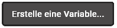
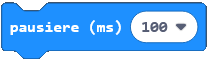

= Relax
:sectnums:

In diesem ersten Programm geht es darum, einen kleinen Helfer zu programmieren, der
beruhigend wirken soll. Das Studium wird ja noch stressig werden :).

== Animation erstellen

Wir starten mit einer kleinen Animation. Diese zeigt einfach verschiedene "Bilder"
hintereinander. So wie bei einem gif.

Für die Animation braucht es etwas, das endlos ausgeführt wird. Bei uns ist das der
Block [dauerhaft]. In diesem Block wird die Animation ausgeführt.

=== zeige LEDs

In den Block [dauerhaft] fügen wir den Block [zeige LEDs] ein.

Hier soll das mittlere
LED leuchten. Klicken Sie einfach drauf. Alle anderen LEDs sollen ausgeschaltet sein.

Kopieren Sie diesen Block noch einmal.

=== Animation

Nun soll sich noch etwas verändern. Schieben Sie einen Block [zeige Symbol] zwischen die
zwei Blöcke [zeige LEDs]. Wählen Sie das folgende Symbol aus.

Kopieren Sie auch diesen Block noch einmal. Es sollte nun ein Punkt sein, dann das obige
Symbol 2 Mal und dann wieder ein Punkt.

Als letztes soll noch einmal ein [zeige Symbol]-Block ganz in der Mitte hinzugefügt werden.
Dieser soll das folgende Symbol anzeigen.

Das Ganze sollte nun so aussehen.

.Blöcke der Lösung
[%collapsible]
====

====

== Geschwindigkeit der Animation

Nun ist die Atmung nicht bei allen gleich schnell, bzw. je nach persönlicher
Verfassung ist sie auch schneller oder langsamer.

Wir setzen das hier so um, dass wir zwischen dem Anzeigen der unterschiedlichen
Bilder eine variable Zeitspanne warten. Dazu verwenden wir eine Variable.

=== Variable einführen

Als erstes soll eine Variable eingeführt werden, die speichert, wie
lange zwischen den einzelnen Bildern gewartet werden soll.

Im Menüpunkt Variablen gibt es einen Button, mit dem neue Variablen
erstellt werden können

Benennen Sie die neue Variable mit dem Namen `pause`.

=== Variable setzten

Nehmen Sie nun den Block [beim Start].

Fügen Sie hier den Block [setzte `pause` auf `0`] ein.

Ersetzen Sie die 0 durch z.B. 200.

=== Variable verwenden

Nun kann diese Variable verwendet werden. Fügen Sie zwischen allen angezeigten
Bildern den Block [pausiere (ms) `100`] ein.

Ersetzen Sie anschliessend die 100 durch die Variable `pause`. Das kann mittels
Drag-And-Drop gemacht werden.

.Blöcke der Lösung
[%collapsible]
====

====

=== Variable verändern

Nun kann man das Programm so einstellen, dass es für einen selber passt. Dies
kann dadurch gemacht werden, dass der Startwert von `pause` auf einen individuellen
Wert gesetzt wird. Wir möchten aber, dass das Programm auch zur Laufzeit, heisst, wenn
es schon auf den Microbit geladen wurde, noch angepasst werden kann. Dazu verwenden wir
die beiden Buttons `A` und `B`.

Nehmen Sie den Block [wenn Knopf `A` gedrückt].

Wenn dieser Knopf gedrückt wird, dann soll die Pause zwischen den Bildern kleiner werden
und das Programm somit schneller.

image::../Bilder/aendereVariable.png[]

Ersetzen Sie die `1` nun um `-100`.

Kopieren Sie den ganzen Block und ändern Sie den Knopf auf `B` und die Zahl um
die verändert wird auf 100.

.Blöcke der Lösung
[%collapsible]
====

====

Testen Sie das Programm nun ausgiebig.