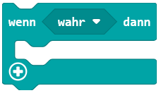

= Match Finder
:sectnums:

In diesem Programm geht es darum, jeweils zu zweit Fragen zu beantworten
und anschliessend auszuwerten, wie viele Übereinstimmungen es gegeben hat.

Der Knopf `A` steht dabei für `Nein`. `B` steht für `Ja`.

Die Fragen sind:

. Magst du lieber Pizza oder Pasta? (Pizza -> B) (Pasta -> A)
. Welchen Rechner verwendest du? (Windows -> B) (Mac -> A)
. Studierst du iCompetence? (Ja -> B) (Nein -> A)
. Hast du eine technische BM? (Ja -> B) (Nein -> A)
. Hast du den freiwilligen Programmiertest geschrieben? (Ja -> B) (Nein -> A)

== Eigenen Balken einfärben

=== Vorbereitung
Als Erstes wird eine Variable gebraucht, die zählt, bei welcher
Frage man sich befindet.

image::../Bilder/erstelleVariable.png[]

Benennen Sie die Variable mit `meineRunde`.
Diese Variable soll beim Starten auf `0` gesetzt werden.

.Lösung
[%collapsible]
====

====

=== Fragen beantworten

Nun brauchen Sie zwei Mal den Block [wenn Knopf `A` gedrückt]. Einmal
für den Knopf `A` und einmal für den Knopf `B`.

Wenn der Knopf `A` gedrückt wurde, dann soll die Variable `meineRunde` um 1
erhöht werden.

Wenn der Knopf `B` gedrückt wurde, dann soll die Variable `meineRunde` auch
um 1 erhöht werden. Zusätzlich soll aber auch noch das zur Frage
gehörige LED aufleuchten.

Setzen Sie den Block [Zeichne x `0` y `0`] *vor* den Block [ändere `meineRunde` um 1]

image::../Bilder/zeichneLED.png[]

Im Block [Zeichne x `0` y `0`] soll  x mit `0` stehen bleiben und y
den Wert von `meineRunde` bekommen.

Starten Sie das Programm einmal und beantworten Sie die 5 Fragen zum Testen.

- Beantworten Sie einmal alle Fragen mit "B". (Die 5 LEDs ganz links leuchten)
- Beantworten Sie einmal alle Fragen mit "A".
- Mischen Sie "A" und "B".

.Lösung bisher
[%collapsible]
====

====

== Versenden über Funk

Damit die eigenen Angaben mit den Angaben von jemand anderem verglichen werden
können, müssen Sie verschickt werden. Dies geschieht über den Funk.

Es wird dafür der Block [sende Zahl `0` über Funk] verwendet.

Dieser Block wird einmal beim Block [wenn Knopf `A` gedrückt] hinzugefügt und einmal
im Block [wenn Knopf `B` gedrückt]. Beim Block [wenn Knopf `B` gedrückt] wird aber
die Zahl `1` verschickt.

.Lösung bisher
[%collapsible]
====

====

== Darstellen der Auswahl einer Partnerin/ eines Partners

=== Vorbereitung: Variable für die Runden des Partners/der Partnerin
Nun sollen diese Werte auch noch empfangen werden. Zusätzlich muss auch noch
gespeichert werden, zu welcher Frage diese Antwort gehört. Fügen Sie also noch die
zusätzliche Variable `partnerRunde` ein. Auch diese soll beim
Starten auf `0` gesetzt werden.

=== Empfangen der Werte

Fügen Sie den Block [wenn Zahl empfangen `receivedNumber`] ein.

Nun soll, wenn eine 1 empfangen wurde, das LED dieser Antwort aufleuchen, wenn
0 empfangen wurde, soll nichts passieren.
In beiden Fällen aber soll die `partnerRunde` um 1 erhöht werden.

Wir verwenden den Block [wenn `wahr` dann]

Innerhalb setzen wir das LED mit:

image::../Bilder/zeichneLED.png[]

Hier nehmen wir nun aber für x den Wert `1` für y analog zu oben den Wert von
`partnerRunde`.

Nun soll das dann gezeichnet werden, wenn eben die Zahl 1 empfangen wurde. Dazu wird der
Block [`0` = `0`] verwendet.

Anstelle der ersten `0` wird `receivedNumber` verwendet. Das kann einfach mit "Drag and Drop"
gelöst werden.

Anstelle der `0` auf der rechten Seite soll `1` eingesetzt werden.

Im Anschluss an diesen [wenn [`receivedNumber`=`1`] dann]-Block soll die `partnerRunde`
um 1 erhöht werden.

.Lösung bisher
[%collapsible]
====

====

Machen Sie nun zu zweit den Test, ob Sie die Antworten des jeweils anderen sehen.

== Vergleichen von Werten (evtl. Erweiterung)

Nun soll zuletzt noch verglichen werden, wie viele Übereinstimmungen
es gegeben hat. Dazu werden die LEDs in der ersten und zweiten Spalte verglichen.
Diese Prüfung soll gemacht werden, wenn das Logo des Micr:Bits gedrückt wird.

=== Vergleichen von zwei LEDs

Um die Logik zu entwickeln, sollen als erstes die beiden LEDs an den Positionen
(`0`, `0`) und (`1`,`0`) verglichen werden.

Eine Übereinstimmung liegt vor, wenn beide LEDs leuchten oder wenn beide nicht
leuchten.

Um zu prüfen, verwenden wir den Block [wenn `true` dann].

Anstelle von `wahr` soll der Block [` ` und ` `] verwendet werden.

Hier kann nun links und rechts ein Block vom Typ [Punkt x `0` y `0`] eingefügt werden.

Bei einem der beiden soll der Wert von x noch auf 1 gesetzt werden.

Falls eine Übereinstimmung da ist, dann soll das LED in der Spalte ganz rechts
aufleuchten.

image::../Bilder/zeichneLED.png[]

Ändern Sie den Block in [Zeichne x `4` y `0`]

Testen Sie!

Es ist so, dass nun nur angezeigt wird, wenn beide Personen ja gesagt haben. Es
soll aber auch einen Match anzeigen, wenn beide nein sagen.

Der wenn-Block soll erweitert werden und der Test um den Block [nicht ` `] ergänzt.

Mit diesem Block wird ein Nein sozusagen in ein Ja umgekehrt. Dies aber nur für
den internen Vergleich.

Der Block soll am Ende so aussehen.

=== Vergleichen von allen 5 LEDs

Jetzt wird aber nur für die erste Frage der Test durchgeführt. Man könnte
nun den ganzen wenn-Block 5 Mal schreiben und einfach die y-Koordinate bei allen
anpassen.

Die bessere Lösung ist aber, wenn mit einer Schleife gearbeitet wird.

In diesen Block nehmen wir die Verzweigung vom Abschnitt vorher.

Anschliessend wird überall beim y-Wert der Wert von `Index` verwendet.

Testen Sie das Programm nun ausführlich mit unterschiedlichen Personen.

== Reset

Um das Programm neu zu starten, kann auf der Rückseite des Microbit
der [reset]-Button gedrückt werden.