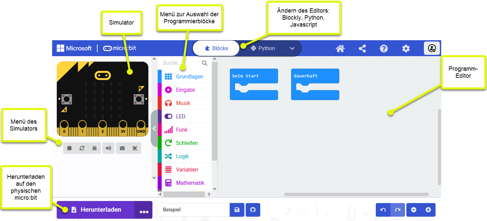

= MicroBit

Der Microbit ist ein Micro-Controller, der enwickelt wurde, um kleine IOT-Projekte zu machen.
Er ist mit unterschiedlichen Tools programmierbar. Hier wird der Webeditor verwendet,
bei dem mit Blockly, Javascript und Python gearbeitet werden kann.

Webseite: https://microbit.org/

== Webeditor

Der Webeditor ist über folgenden Link erreichbar: https://makecode.microbit.org/#editor

Der Webeditor beinhaltet neben dem Programmiereditor auch noch einen Simulator, in dem die Programme
getestet werden können.

== Tutorials von Microbit.org

. Kompass 1: https://microbit.org/projects/make-it-code-it/compass-bearing/
. Kompass 2: https://microbit.org/projects/make-it-code-it/compass-north/
. Thermometer:  https://microbit.org/projects/make-it-code-it/thermometer
. Thermometer 2: https://microbit.org/projects/make-it-code-it/max-min-thermometer/

== Aufgaben

Die vier Programme, welche programmiert werden können sind:

. link:Atmung/Leitprogramm.adoc[Atmung]
. link:Schrittzaehler/Leitprogramm.adoc[Schrittzähler]
. link:SchereSteinPapier/Leitprogramm.adoc[Schere Stein Papier]
. link:Kennenlernen/Leitprogramm.adoc[Match Finder]

== JoyCar

Webseite: https://joycar.joy-it.net/de/

Anleitung: link:JoyCar/MB-Joy-Car_Anleitung_2021-04-30.pdf[MB-Joy-Car_Anleitung_2021-04-30.pdf]

