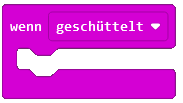
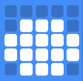
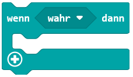
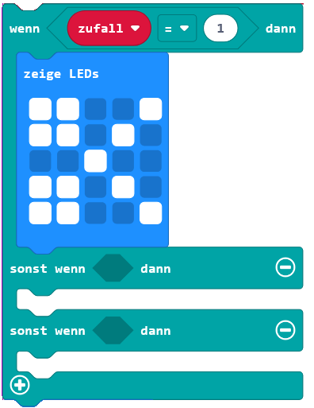

= Schere Stein Papier
:sectnums:

In diesem Programm soll das Spiel footnote:[https://microbit.org/projects/make-it-code-it/rock-paper-scissors/]
Schere, Stein, Papier implementiert werden.

== Die drei Bilder
Der Code soll im Block [wenn geschüttelt] geschrieben werden.

Als Erstes sollen in diesem Hauptblock die drei Bilder angezeigt werden. Sie brauchen
ein Bild für die Schere, eines für den Stein und eines für das Papier. Das Folgende
sind Vorschläge dafür, Sie können aber auch eigene Bilder zeichnen.

== Variable mit Zufallszahl
Nun soll eines der Bilder zufällig ausgewählt werden. Dafür benötigen wir eine
Zufallszahl. Erstellen Sie wieder eine Variable und benennen Sie diese mit [zufall].
Fügen Sie den Block [setzte "zufall" auf "0"] vor den drei Bildern ein.

Aus dem Bereich Mathematik brauchen wir zum Erstellen einer Zufallszahl den Block
[wähle eine zufällige Zahl von "0" bis "10"]. Dieser Block kommt anstelle der "0"
aus dem Block [setzte "zufall" auf "0"].

Wir haben in unserem Spiel 3 Elemente zur Auswahl. Somit möchten wir eine Zahl zwischen
1 und 3 haben. Beide Grenzen sind hier inklusive.

Der Block sollte am Ende so aussehen:

Das bedeutet, dass der Computer eine Zahl zwischen 1 und 3 würfelt und diese
dann in der Variablen `zufall` abspeichert.

== Verzweigung (Teil 1)
Aufgrund der zufällig gewählten Zahl soll entsprechend nur ein Bild angezeigt werden. Bei
der 1 soll die Schere erscheinen, bei der 2 der Stein und bei der 3 das Papier.

Dazu wird ein Block aus dem Bereich der Logik verwendet. Wir nehmen gleich den ersten
[wenn "wahr" dann].

Anstelle von `wahr` soll nun die Zufallszahl überprüft werden. Dazu verwenden wir
den Block ["0" = "0"] aus dem Bereich der Logik.

Auf der linken Seite soll die `0` durch die Variablen `zufall` ersetzt werden.
Die `0` auf der rechten Seite wird durch eine 1 ersetzt.

Das Bild der Schere soll nun in diesen Block verschoben werden.

== Verzweigung (Teil 2)

Damit wird die zwei anderen Tests noch hinzufügen können, muss der Block [wenn "wahr" dann]
noch erweitert werden.

Klicken Sie 3 Mal auf das Plus am Ende des Blocks. Dann löschen Sie den letzten Block
wieder. Der Block sollte am Ende so aussehen:

Ergänzen Sie den Rest des Blockes analog zum ersten Teil.

== Löschen

Wenn der Button `A` gedrückt wird, soll der Bildschirm gelöscht werden.

== Spielen

Laden Sie nun das Programm auf Ihren Microbit und spielen Sie gegen einen Kollegen
oder eine Kollegin.
Überprüfen Sie dabei auch, wie zufällig die Zufallszahl gewählt wird. Machen Sie
pro Element einen kleine Statistik.

== Erweiterungen

Die Erweiterung des Gewinne-Zählens ist einfacher als das Verschicken des Symbols.
Beide sollten unabhängig voneinander gelöst werden.

=== Zählen der Gewinne

Wenn der Button b gedrückt wird, wird ein Zähler erhöht, der die Gewinne zählt.
Sie brauchen dafür noch eine zusätzliche Variable.

=== Verschicken des Symbols

Die Überprüfung, wer gewonnen hat, kann auch über den Microbit gemacht werden.
Verschicken Sie Ihre Zufallszahl dazu über den Funk.
