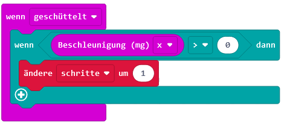

= Schrittzähler
:sectnums:

Beim Programm Schrittzähler footnote:[Inspiriert von: https://microbit.org/projects/make-it-code-it/sensitive-step-counter/] geht es darum zu zählen, wie viele Schritte jemand macht.

== Basisprogramm

Der Schrittzähler wird im Block [wenn `geschüttelt`] geschrieben.

image::../Bilder/wenngeschuettelt.png[]

Jedes Mal, wenn der Microbit geschüttelt wird (das wird als Schritt gewertet), soll ein Zähler
eins hochzählen.

Erstellen Sie also eine Variable und benennen Sie diese mit dem Namen `schritte`.

image::../Bilder/erstelleVariable.png[]

Nun soll diese Variable immer um 1 hochgezählt werden, wenn der Microbit geschüttelt wird.
Verwenden Sie dazu den Block [ändere `schritte` um `1`]

== Werte anzeigen

Nun soll man auch noch ablesen können, wie viele Schritte gemacht wurden. Nehmen Sie
dazu den Block [wenn Knopf `A` gedrückt].

Fügen Sie dann den Block [zeige Zahl `0`] hinzu und ersetzen Sie die `0` durch `schritte`.

== Zurücksetzen

Damit eine neue Stecke "gemessen" werden kann, soll der Zähler auch wieder zurückgesetzt
werden können. Dies soll geschehen, wenn die Taste `B` gedrückt wird. Nehmen Sie
dazu den Block [wenn Knopf `A` gedrückt] und ändern Sie mit dem Dropdown Menu `A` zu `B`.

Fügen Sie dann den Block [setzte `schritte` auf `0`] ein.

== Testen
Zählen Sie die Schritte, die Sie für den Weg vom Gruppenraum zum Plenarraum brauchen. Schreiben Sie
alle Werte mit Namen an die Tafel.

== Erweiterungen
=== Beschleunigung messen / kalibrieren
Die Verwendung des Blocks [wenn `geschüttelt`] sagt nicht viel über die Stärke des Schüttelns aus.
Der Microbit kann aber messen, wie stark er geschüttelt wird.

Ergänzen Sie den Block [wenn `geschüttelt`] wie folgt.

Testen Sie nun, welche Werte und welche Achsen (x,y,z oder stärke) für die
Messung eines Schritts am besten geeignet sind.

=== Darstellung der Schrittzahl mit den LEDs

Die "Laufleistendarstellung" der Anzahl Schritte ist bei einer grösseren Menge nicht
mehr sehr übersichtlich und es wäre eigentlich schön, wenn die Anzahl
Schritte immer ersichtlich wäre.

Überlegen Sie sich in einer Gruppe, wie Sie mit den LEDs eine Darstellung machen
könnten.

